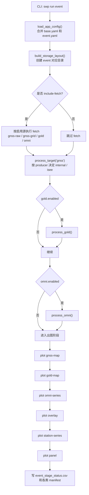
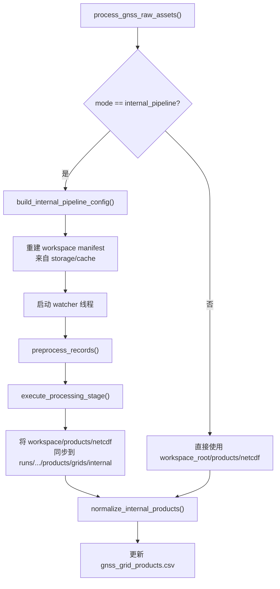

# sw_pipeline 项目介绍

## 1. 项目定位

`sw_pipeline` 是一个面向空间天气事件分析的统一流水线项目。它把原本分散的 GNSS、GOLD、OMNI 数据获取与绘图流程，收敛到一套以事件 YAML 为中心的编排模型里，目标是让一次事件分析具备以下特征：

- 同一份事件配置驱动数据抓取、处理、出图和拼图。
- 同时兼容外部现成产品和内部 GNSS 反演产品。
- 运行结果按事件隔离，便于复盘、复现和清理。
- `storage/cache` 作为长期输入资产区，`storage/runs/<event_id>` 作为一次运行的产物区。
- 所有关键阶段都能落 manifest，方便检查“拿到了什么、处理了什么、输出了什么”。

项目当前聚焦的产物类型包括：

- GNSS 网格图：`VTEC`、`ROTI`
- GOLD 配对场景图
- OMNI 时序图
- `ROTI on GOLD` 叠加图
- 指定测站双星 `VTEC/ROTI` 四宫格
- 多种面板拼图

## 2. 核心设计思路

### 2.1 事件驱动

整个项目围绕 `EventSpec` 运行。程序启动时会：

1. 读取 `config/base.yaml`
2. 读取 `config/events/<event_id>.yaml`
3. 深度合并配置
4. 执行严格校验
5. 生成本次事件对应的目录布局和运行上下文

这意味着项目真正的“入口”不是某个硬编码脚本，而是事件配置文件。

### 2.2 分层清晰

代码结构按职责拆分为几层：

- CLI/编排层：解析命令、决定阶段顺序
- Provider 层：负责数据获取和处理准备
- Normalizer 层：把不同来源的产品归一成统一元数据对象
- Renderer 层：负责所有最终图件输出
- Registry/Manifest 层：负责落盘和读取 CSV 清单
- Internal 层：复用旧 GNSS / GOLD 核心算法实现

### 2.3 Cache First

项目大量实现都优先复用已有缓存，而不是重复下载：

- `fetch_*` 会先看 manifest 是否已经存在
- `process_*` 会在 manifest 缺失时回退到 `storage/cache` 自动发现
- OMNI、GOLD、ISEE 网格都支持“本地已有文件直接接管”
- 内部 GNSS 处理还支持从现成 workspace 快照恢复

因此它本质上不是“只会联网抓数据”的脚本集合，而是“优先消费本地资产、必要时才补下载”的事件流水线。

### 2.4 写入安全

项目显式保护 `storage/cache`：

- `storage.py` 中的 `ensure_storage_write_allowed()` 禁止修改受保护缓存目录
- 清理命令只允许删除 `storage/runs/<event_id>` 下的生成内容
- `clean workspace` 不会碰 `storage/cache`

这保证了缓存资产与可重建产物之间的边界足够清晰。

## 3. 代码结构总览

```text
sw_pipeline/
├─ config/
│  ├─ base.yaml
│  └─ events/
├─ docs/
│  └─ PROJECT_INTRODUCTION.md
├─ src/sw_pipeline/
│  ├─ cli.py                 # 命令行入口
│  ├─ app.py                 # 运行编排与阶段调度
│  ├─ config.py              # 配置加载、合并、校验
│  ├─ models.py              # EventSpec / StorageLayout 等核心模型
│  ├─ storage.py             # 目录布局与写入保护
│  ├─ discovery.py           # 从 cache 自动发现资产
│  ├─ downloaders.py         # HTTP/FTP 下载基础能力
│  ├─ cleanup.py             # 清理逻辑
│  ├─ providers/             # 各数据源 fetch/process 逻辑
│  ├─ pipelines/             # 上层流程包装
│  ├─ normalizers/           # 产品标准化
│  ├─ renderers/             # 各类图件绘制
│  ├─ registry/              # manifest / 配对 / 迁移
│  └─ internal/              # 旧核心 GNSS / GOLD 算法封装
├─ storage/
│  ├─ cache/                 # 长期缓存输入资产
│  └─ runs/<event_id>/       # 单次事件运行产物
└─ tests/
   ├─ unit/
   └─ integration/
```

## 4. 关键模块职责

| 模块 | 作用 |
| --- | --- |
| `cli.py` | 解析 `swp run/fetch/process/plot/clean/migrate-legacy` 命令 |
| `app.py` | 决定本次事件哪些阶段要跑、按什么顺序跑，并持续写 `event_stage_status.csv` |
| `config.py` | 合并 `base + event` 配置，校验 bbox、sources、figures、panel/overlay 规则 |
| `models.py` | 定义 `EventSpec`、`OverlaySpec`、`PanelSpec`、`StorageLayout` 等统一对象 |
| `providers/gnss_raw.py` | 处理原始 GNSS 下载、内部流水线配置生成、workspace 恢复和 NetCDF 同步 |
| `providers/gnss_grid.py` | 处理 ISEE 网格数据的本地接管或远程下载 |
| `providers/gold.py` | 处理本地 GOLD tar 包发现与场景配对 |
| `providers/omni.py` | 处理本地 OMNI 文件接入或远程 HAPI 拉取 |
| `normalizers/gnss.py` | 将 internal / ISEE 网格归一成统一 `GnssGridProduct` 列表 |
| `renderers/` | 输出 GNSS 地图、GOLD 图、OMNI 图、overlay、station series、panel |
| `registry/manifests.py` | 统一写读 CSV manifest |
| `registry/pairing.py` | 提供时间邻近配对能力 |
| `registry/legacy_import.py` | 将旧项目结果迁入当前缓存布局 |
| `internal/gnss_core` | 旧 GNSS 下载、预处理、处理、绘图核心逻辑 |
| `internal/gold_core.py` | GOLD tar 解析、通道配对、网格化与绘图基础能力 |

## 5. 配置模型

### 5.1 基础配置 `config/base.yaml`

基础配置定义全局默认项，主要包括：

- `paths.storage_root`
- 固定地图范围 `bbox`
- CDDIS 认证信息
- GNSS 原始观测下载源及辅助产品下载源
- 全局运行参数 `runtime`
- 统一绘图参数 `plot_defaults`

其中 `bbox` 是强约束，当前代码要求必须固定为：

```yaml
lon_min: -150.0
lon_max: 10.0
lat_min: -80.0
lat_max: 80.0
```

这反映出项目目前的地图范围是有意标准化的，而不是每次事件任意切换。

### 5.2 事件配置 `config/events/<event_id>.yaml`

事件配置覆盖一次具体分析，通常包含：

- `event`
  - `id`
  - `start`
  - `end`
- `sources`
  - `gnss_raw`
  - `gnss_grid`
  - `gold`
  - `omni`
- `products`
  - `gnss_grid.map_producers`
- `figures`
  - `gnss_maps`
  - `overlays`
  - `panels`
  - `station_series`
  - `omni_series`

### 5.3 配置约束

当前项目对配置做了较严格的约束：

- `products.gnss_grid.map_producers` 只允许 `internal`、`isee`
- `figures.overlays` 最多只支持一个 overlay
- overlay 名称当前只支持 `roti_on_gold`
- panel slot 类型只允许：
  - `gnss_roti`
  - `gnss_vtec`
  - `gold`
  - `overlay`
- `station_series` 每个 preset 至少给两颗卫星
- `omni_series.highlight_windows[].alpha` 必须在 `0 ~ 1`

从这些约束可以看出，项目已经有明确的“产品规范”，不是完全自由拼装。

## 6. 运行入口与命令模型

CLI 对外暴露的主命令如下：

```powershell
swp run event --event storm_20241010_11
swp run event --event storm_20241010_11 --include-fetch
swp fetch gnss-raw --event storm_20241010_11
swp fetch gnss-grid --event storm_20241010_11
swp fetch gold --event storm_20241010_11
swp fetch omni --event storm_20241010_11
swp process gnss --event storm_20241010_11
swp process gold --event storm_20241010_11
swp process omni --event storm_20241010_11
swp plot gnss-map --event storm_20241010_11
swp plot gold-map --event storm_20241010_11
swp plot omni-series --event storm_20241010_11
swp plot overlay --event storm_20241010_11
swp plot station-series --event storm_20241010_11
swp plot panel --event storm_20241010_11
swp clean workspace
swp clean run --event storm_20241010_11
swp migrate-legacy --from <legacy_path>
```

其中最重要的一点是：

- `swp run event` 默认只跑 `process + plot`
- 只有显式带上 `--include-fetch` 才会触发抓取阶段

这体现出项目的默认预期是“缓存已经准备好，运行主要是复现处理和出图”。

## 7. 全局运行流程

下面是 `swp run event --event <event_id> [--include-fetch]` 的高层流程：



## 8. GNSS 子流程详解

GNSS 是项目里最复杂的一块，原因是它同时支持两套来源：

- `isee`：直接使用外部 GNSS 网格产品
- `internal`：从原始 RINEX 观测和辅助产品走内部处理链路，产出自己的 NetCDF 网格

### 8.1 `gnss_grid` 外部产品链路

`providers/gnss_grid.py` 支持两种模式：

- `local`
  - 从本地目录读取 `.nc`
  - 复制到 `storage/cache/gnss_grid/isee/...`
- `remote`
  - 访问 ISEE 对应年份/DOY 目录
  - 解析 HTML 中的 `.nc` 链接
  - 下载到 `storage/cache/gnss_grid/isee/...`

随后 `process_gnss_grid_assets()` 会把缓存文件再 stage 到：

- `storage/runs/<event_id>/products/grids/isee/...`

并通过 `normalize_isee_products()` 归一成统一的 `GnssGridProduct` 元数据。

### 8.2 `gnss_raw` 内部产品链路

`providers/gnss_raw.py` 支持三种模式：

- `internal_pipeline`
  - 自动构造内部 GNSS runtime YAML
  - 下载观测和辅助产品
  - 执行预处理和处理
  - 把生成的 NetCDF 同步到运行目录
- `workspace_snapshot`
  - 直接复用已有内部 workspace
- `local_workspace`
  - 与 `workspace_snapshot` 类似，直接从指定 workspace 消费已有产物

内部 GNSS 的主流程如下：



这个设计很关键，说明当前仓库并不是简单“调用旧脚本”，而是在新流水线里对旧 GNSS 核心做了一层适配：

- 新层负责事件配置、目录布局、manifest 和缓存规则
- 旧层负责下载发现、RINEX 预处理、VTEC/ROTI 计算、NetCDF 输出

### 8.3 为什么 station series 会强制触发 internal 处理

在 `app.process_target()` 中，只要配置了 `station_series`，即使 `map_producers` 只有 `isee`，也会补跑一次内部 GNSS 处理。原因很直接：

- station series 依赖内部 workspace 里的中间 parquet
- 仅靠 ISEE 成品网格无法生成指定测站单星散点图

这是项目里一个很重要的隐式依赖关系。

## 9. GOLD 子流程

GOLD 当前只实现本地模式：

1. 从 `sources.gold.inputs` 指向的目录或 tar 文件中收集 `.tar`
2. 统一 stage 到 `storage/cache/gold/`
3. 用 `internal/gold_core.py` 发现通道条目
4. 按 `gold_max_pair_minutes` 配对 `CHA/CHB`
5. 过滤到事件日期范围内
6. 生成 `gold_scenes.csv`
7. 由 renderer 输出单图或作为 overlay/panel 的底图来源

项目没有把 GOLD 做成“逐文件预处理后再绘制”的复杂链路，而是倾向于：

- tar 归档级缓存
- 运行时按需发现和配对

这种方式实现简单，也适合事件级回放。

## 10. OMNI 子流程

OMNI 支持两种模式：

- `local`
  - 直接接现成 CSV
  - 如果未指定 `files`，会按标准文件名自动推断
- `remote`
  - 通过 HAPI 接口拉取 `BZ_GSM`、`KP1800`、`DST1800`
  - 生成三类标准 CSV：
    - `omni_bz_1min_<event_id>.csv`
    - `omni_dst_kp_hourly_<event_id>.csv`
    - `omni_kp_3hour_<event_id>.csv`

处理阶段只是把这些 CSV stage 到：

- `storage/runs/<event_id>/processed/omni/`

然后写 `omni_series.csv` manifest，供时序绘图直接消费。

## 11. 出图体系

### 11.1 GNSS 地图

`renderers/gnss_map.py` 做的事情包括：

- 遍历 `GnssGridProduct`
- 按 metric 切片
- 识别不同数据集里的坐标和变量名
- 统一裁剪到固定地图范围
- 可选绘制磁赤道
- 输出到 `figures/gnss/<producer>/<metric>/`

### 11.2 GOLD 地图

`renderers/gold_map.py` 基于 `gold_core` 的场景读取和网格化能力，绘制对应时刻的 GOLD 图件。

### 11.3 Overlay

当前 overlay 只支持 `roti_on_gold`。其处理特点是：

- 如果配置中显式提供 `pairs`，优先用显式配对
- 否则使用最近时间贪心配对
- 对 GNSS 值做严格阈值筛选：只有 `>` threshold 的像元会保留
- 当 `bin_size_deg` 大于原始格点分辨率时，会先把热点点位聚合后再叠加到底图上
- 输出明细写到 `<overlay_name>_pairs.csv`

因此 overlay 既可以做“自动时间配准”，也可以做“论文/汇报指定时刻复现”。

### 11.4 Station Series

station series 直接读取内部 workspace 中间产物：

- `intermediate/vtec/<event_id>.parquet`
- `intermediate/roti/<event_id>.parquet`

然后按：

- 测站
- 时间窗
- 两颗卫星

生成固定 2x2 布局的散点图。输出到：

- `figures/station_series/<preset_name>.png`

### 11.5 Panels

panel 渲染器是一个“二次编排层”。它不会重新处理数据，而是根据 panel slot 定义去解析：

- 指定 producer 的 GNSS slice
- 指定 `CHA/CHB` 的 GOLD 场景
- 指定 `gnss_timestamp + gold pair` 的 overlay

然后统一拼成一个大图，并记录到 `panel_outputs.csv`。

这让 panel 不再依赖额外脚本，而是成为事件配置的自然扩展。

## 12. Manifest 与产物布局

一次标准事件运行的核心输出结构如下：

```text
storage/runs/<event_id>/
├─ manifests/
│  ├─ event_stage_status.csv
│  ├─ gnss_raw_assets.csv
│  ├─ gnss_station_candidates.csv
│  ├─ gnss_observation_assets.csv
│  ├─ gnss_navigation_assets.csv
│  ├─ gnss_aux_assets.csv
│  ├─ gnss_grid_products.csv
│  ├─ gold_scenes.csv
│  ├─ omni_series.csv
│  ├─ roti_on_gold_pairs.csv
│  └─ panel_outputs.csv
├─ processed/
│  ├─ gnss/
│  │  ├─ <event_id>_pipeline.yaml
│  │  └─ internal_workspace/
│  ├─ gold/
│  └─ omni/
├─ products/
│  └─ grids/
│     ├─ internal/
│     └─ isee/
└─ figures/
   ├─ gnss/
   ├─ gold/
   ├─ omni/
   ├─ overlays/
   ├─ panels/
   └─ station_series/
```

这里最有价值的设计点是：

- `manifests/` 记录运行事实
- `processed/` 保存过程性产物
- `products/` 保存规范化后的最终产品
- `figures/` 保存最终图件

这让同一个事件既能被“科研复现”使用，也能被“交付物检查”使用。

## 13. 测试与质量保障

测试覆盖面围绕“流程稳定性”而不是单一算法数值精度，重点包括：

- `test_app.py`
  - 验证 `run event` 默认不抓取
  - 验证 `--include-fetch` 行为
  - 验证 station series 会触发内部 GNSS 处理
- `test_cache_first.py`
  - 验证 manifest 缺失时可从 cache 自动恢复
- `test_config.py`
  - 验证配置校验规则
- `test_downloads.py`
  - 验证下载回退策略，如 NOAA 失败后回退
- `test_overlay_renderer.py`
  - 验证显式 overlay pair 优先
- `test_panel_renderer.py`
  - 验证 panel 共享色标与显式时刻解析
- `test_station_series.py`
  - 验证内部 workspace station series 渲染
- `tests/integration/test_integration.py`
  - 验证本地资产驱动的端到端运行

整体来看，项目的测试风格非常符合当前架构重点：保证“配置驱动流程”和“缓存优先行为”稳定可靠。

## 14. 项目当前边界与限制

基于现有代码，当前版本的已知边界包括：

- GOLD 只实现了本地输入模式
- overlay 当前只支持 `roti_on_gold`
- 地图范围固定，不支持事件级自定义 bbox
- panel slot 类型受限于现有几类图件
- GNSS 原始处理核心仍然依赖 `internal/gnss_core` 旧实现

这些限制并不表示项目不完整，反而说明它已经收敛到一套明确的交付场景。

## 15. 适合继续扩展的方向

如果后续继续发展，这个项目最自然的扩展方向是：

1. 把 `config/templates/internal_gnss_runtime.yaml` 正式纳入仓库，形成内部 GNSS 的可维护模板层。
2. 扩展 overlay 类型，而不是把新叠加逻辑继续散落在单独脚本里。
3. 为 `figures/` 输出补更多 manifest 级元数据，例如图件参数快照。
4. 为 `storage/cache` 增加更完整的目录说明，方便长期资产整理。
5. 若后续有 Web 或服务化需求，可以直接复用 `EventSpec + manifest` 这一套模型。

## 16. 一句话总结

`sw_pipeline` 的本质不是“几个抓数据和出图脚本的集合”，而是一个以事件配置为中心、以缓存和 manifest 为骨架、把 GNSS / GOLD / OMNI 统一编排起来的空间天气事件生产流水线。
